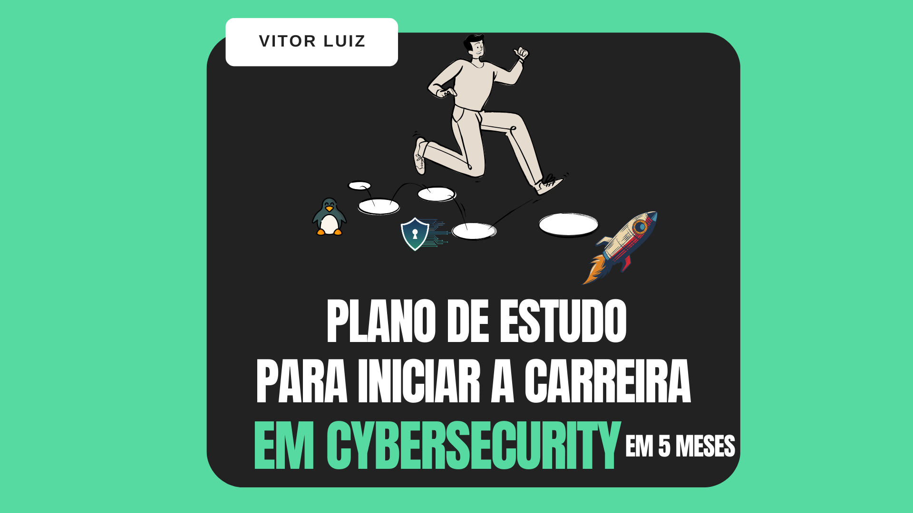

# 🧭 Plano de estudos para inciar sua carreira em Cybersecurity

Este é um guia completo para se tornar um engenheiro de cibersegurança de sucesso, baseado em funções como **Pentest**, **AppSec**, **Cloud Security**, **DevSecOps**, **SOC** e muito mais - com recursos gratuitos, ferramentas e conceitos para se destacar.

---

## ✅ Planos Concluídos

- [ ] [Plano de Estudo de Linux](https://github.com/vitorluigi/carreira-em-cyber/blob/main/plano-de-estudo-linux.md)
<!-- - [ ] Plano de Estudo de Habilidades Comuns  
- [ ] Plano de Estudo de Segurança em AWS  
- [ ] Plano de Estudo de Segurança em GCP  
- [ ] Plano de Estudo de Pentest Web  
- [ ] Plano de Testes de Segurança de Aplicações  
- [ ] Plano de Estudo de Segurança de APIs  
- [ ] Plano de Estudo de Modelagem de Ameaças  
- [ ] Plano de Estudo de GRC (Governança, Riscos e Conformidade)  

---
-->

## 📌 Próximos Planos

- [ ] Plano de Estudo de Pentest Web  
- [ ] Plano de Estudo de DevSecOps  
- [ ] Plano de Testes de Segurança de Aplicações  
- [ ] Plano de Estudo de Segurança de APIs  
- [ ] Plano de Estudo de Modelagem de Ameaças  
- [ ] Plano de Estudo de GRC (Governança, Riscos e Conformidade)  
- [ ] Plano de Estudo de Segurança em AWS  
- [ ] Plano de Estudo de Segurança em GCP  
- [ ] Plano de Estudo de Segurança em Azure  
- [ ] Plano de Estudo de Segurança com Docker  
- [ ] Plano de Estudo de Segurança com Kubernetes  
- [ ] Plano de Estudo de Segurança de Redes  
- [ ] Plano de Estudo de Criptografia  
- [ ] Plano de Estudo de Segurança da Cadeia de Suprimentos de Software  
- [ ] Plano de Estudo de Security Code Review
- [ ] Plano de Estudo de Ciclo de Vida de Desenvolvimento Seguro  
- [ ] Plano de Estudo de Arquitetura de Segurança  

---

## 📖 Por que criei este repositório?

Criei este projeto inspirado em iniciativas como o [coding-interview-security](https://github.com/jwasham/coding-interview-university), que me tocarem e motivou a colaborar com a comunidade interessada em começar a carreira em segurança. O objetivo é ajudar pessoas que precisam de **orientação clara** para aprender habilidades específicas de forma prática.

Se você estudar de **3 a 4 horas por dia durante 5 meses**, praticar bastante e revisar os conceitos importantes mais de uma vez, você terá tudo para conquistar uma vaga de alto nível na área.

<!---
## 💡 Dica

Alguns tópicos são comuns a todas as áreas de segurança listadas. Veja:  
📎 [`common-skills-study-plan`](https://github.com/jassics/cybersecurity-skills-career-roadmap/blob/master/common-skills.md)
-->
---

## ⚙️ Pré-requisitos

- Comprometimento diário
- Origem técnica (ajuda, mas não é obrigatório)
- Persistência e curiosidade
- Mentalidade hacker 
- Curiosidade e desejo de explorar por conta própria

---

## 🧭 Como usar este repositório

- Leia de cima para baixo e **marque os tópicos que já domina**
- Clone este repositório e use como **checklist pessoal**
- Aprenda Git e versionamento – habilidades úteis para profissionais de segurança!

---

## 📝 Atualize seu currículo

Antes de aplicar para uma vaga, reflita:

- Qual a área de segurança me encanta mais?
- Qual cargo eu quero ocupar?
- Quais requisitos a vaga pede?
- O trabalho é remoto ou presencial?

Ferramenta útil para construir seu currículo: [rxresu.me](https://rxresu.me)

### Modelos recomendados:
- [Zety](https://zety.com)
- [Easy Resume](https://www.easyresume.io/)
- [Qwikresume (segurança)](https://www.qwikresume.com)
- Exemplo: DevSecOps, PenTester, Cloud Security, etc.

---

## 🔎 Como buscar vagas?

Refine sua busca com base em:

- Título do cargo
- Suas habilidades versus requisitos da vaga
- Nível de experiência

<!--
### Sites úteis:

- [LinkedIn](https://linkedin.com)
- [Indeed](https://indeed.com)
- [Monster](https://monster.com)
- [Instahyre](https://instahyre.com)
- [Cutshort](https://cutshort.io)
- Comunidades: Null Jobs, Cybersecurity Jobs
-->
---

## 🎯 Preparação para entrevistas

> ⚠️ **Nota:** Essa seção está em desenvolvimento!
<!-- Quando estiver preparado, revise questões comuns como:

- Como você se atualiza sobre segurança?
- Qual foi sua última vulnerabilidade encontrada?
- Por que deveríamos contratar você?
- O que você aprendeu nos últimos meses?
- Onde se vê daqui a 5 anos?

### Recursos úteis:

- [Guru99 - 100+ perguntas](https://www.guru99.com/cyber-security-interview-questions.html)
- [Springboard](https://www.springboard.com/)
- [YouTube - Entrevistas técnicas](https://youtube.com)

-->
---

## 🤝 Contribua com este projeto

Quer colaborar?  
Faça um **fork** do repositório, adicione suas sugestões e envie um **pull request** para revisão.

---

**Desejo bons estudos e sucesso na sua trajetória! 🔐💻**

