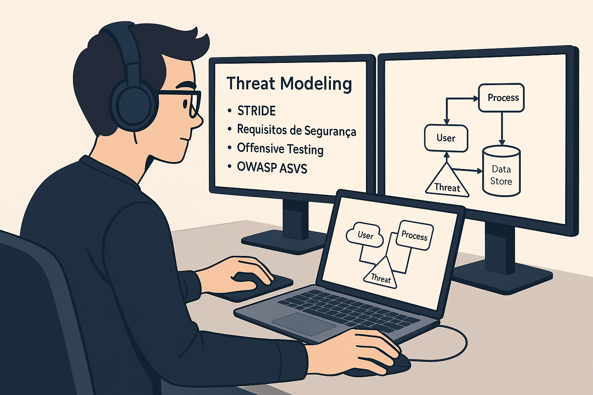
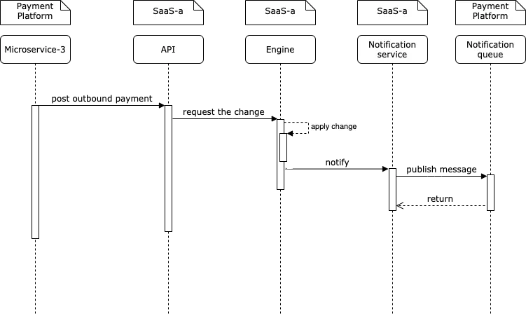
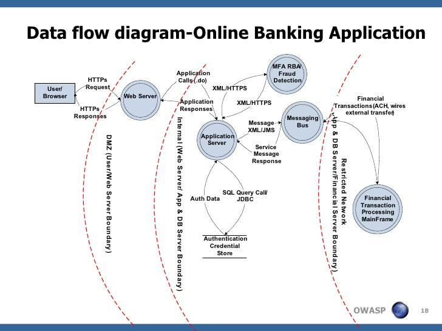

## Modelagem de Ameaças

> ⚠️ **IMPORTANTE:**  
> Se você trabalha com segurança de produtos, segurança de aplicações ou engenharia de segurança, este plano de estudos é mais essencial para você do que para outros profissionais da área. No entanto, recomenda-se que todo profissional de segurança tenha uma boa compreensão dos fundamentos de modelagem de ameaças.

> 💡 **Nota:**  
> Leva cerca de 2-3 meses para adquirir um bom entendimento de Threat Modelling com alguma experiência prática.

### O que é Modelagem de Ameaças

Modelagem de ameaças é uma abordagem estruturada para analisar a segurança de uma aplicação, permitindo identificar, quantificar e tratar riscos de segurança associados.  
Com detalhes sobre ameaças e ataques prováveis, a empresa pode tomar decisões mais eficazes sobre como priorizar iniciativas de segurança.  
Além disso, as decisões de aceitação de risco são mais informadas e alinhadas aos objetivos do negócio.

### Ferramentas para explorar

1. [OWASP Threat Dragon](https://www.threatdragon.com/#/)
2. [Microsoft Threat Modeling Tool](https://learn.microsoft.com/en-us/azure/security/develop/threat-modeling-tool)
3. [STRIDE GPT](https://stridegpt.streamlit.app/)
4. [Threagile](https://run.threagile.io/)
5. [PyTM](https://github.com/izar/pytm)
6. [draw.io](https://www.drawio.com/)
7. [Excalidraw](https://excalidraw.com/)
8. [Iurus Risk - Ferramenta paga para automatizar modelagens](https://www.iriusrisk.com/)
9. [SD Elements - Ferramenta paga para automatizar modelagens](https://www.securitycompass.com/sdelements/)

### Recursos para aprender e praticar

1. https://owasp.org/www-community/Threat_Modeling
2. https://www.simplilearn.com/what-is-threat-modeling-article
3. [Modelagem de Ameaças, o primeiro passo para o Desenvolvimento Seguro de Aplicações](https://medium.com/@fernando-silva/modelagem-de-ameaças-o-primeiro-passo-para-o-desenvolvimento-seguro-de-aplicações-c33649ad856e)
4. [MITRE Cyber Threat Modeling](https://www.mitre.org/sites/default/files/2021-11/prs-18-1174-ngci-cyber-threat-modeling.pdf)
5. https://www.jemurai.com/2020/11/10/risk-and-threat-modeling-with-mind-maps/
6. https://shellsharks.com/threat-modeling
7. [Awesome Threat Modeling (GitHub)](https://github.com/hysnsec/awesome-threat-modelling)
8. [Podcast de Threat Modeling - Chris Romeo](https://open.spotify.com/show/4q9BxNrRb0NWnLBpSmNqoP)
9. [Certificação: Certificação profissional em Modelagem de Ameaças](https://www.practical-devsecops.com/certified-threat-modeling-professional/)
10. [Kubernetes Threat Modeling](https://www.trendmicro.com/vinfo/in/security/news/security-technology/a-deep-dive-into-kubernetes-threat-modeling)
11. [AWS S3 Threat Modeling](https://controlcatalog.trustoncloud.com/dashboard/aws/s3)

### Vídeos

1. [Modelagem de Ameaças: qual o papel da pessoa desenvolvedora?](https://www.youtube.com/watch?v=-grCdXWlydw)
2. [Modelagem de ameaças, canvas. Código Seguro #014](https://www.youtube.com/watch?v=n6UgriY5DU0)
3. [O que é modelagem de ameaças e por que é importante?](https://youtu.be/h_BC6QMWDbA)
4. [Introdução a modelagem de ameaças](https://www.youtube.com/watch?v=GqmQg-cszw4)

### Cursos 
1. [Treinamento gratuito de Modelagem de ameaças da Iurus Risk](https://www.iriusrisk.com/threat-modeling-training)
2. [Treinamento gratuito da Microsoft sobre fundamentos da Modelagem de ameças](https://learn.microsoft.com/pt-br/training/modules/tm-introduction-to-threat-modeling)
3. [Treinaemnto gratuito da Microsoft sobre análise de fluxo de dados e STRIDE](https://learn.microsoft.com/en-us/training/paths/tm-threat-modeling-fundamentals)
4. [Curso Pago na Udemy: STRIDE - Taimur](https://www.udemy.com/course/threat-modeling-using-stride-masterclass/?couponCode=IND21PM)

### Livros

1. [Threat Modeling: A Practical Guide for Development Teams](https://a.co/d/23Bfseu)
2. [Mastering Threat Modeling A Comprehensive Guide to Identifying and Mitigating Risks](https://a.co/d/790xsbY)

> 💡 **DICA:**  
> Além deste material, dê uma revisada no [OWASP Threat Modeling Cheat Sheet](https://cheatsheetseries.owasp.org/cheatsheets/Threat_Modeling_Cheat_Sheet.html) para entendimento básico.

Em resumo:

- **Modelagem de ameaças é o processo** de identificar, analisar e mitigar ameaças de segurança potenciais a um sistema ou organização.
- Envolve identificar os ativos a serem protegidos, analisar as ameaças potenciais e desenvolver estratégias para mitigá-las ou eliminá-las.
- Quanto mais cedo a modelagem for realizada, melhores os resultados, mas é comum encontrar ambientes estabelecidos e com aplicações em produção que também pode ser necessário realizar a modelagem de ameaças para maior entendimento da solução pelo engenheiro de segurança.

### Objetivos da Modelagem de Ameaças

1. Identificar os limites de confiança do sistema
2. Reconhecer os atores que interagem dentro e fora desses limites
3. Entender os fluxos de informação entre os limites
4. Avaliar a persistência das informações dentro e fora dos limites
5. Mapear ameaças que transgridem os limites de confiança
6. Identificar vulnerabilidades nos limites acessados por atores e nos fluxos de informação
7. Conhecer os agentes de ameaça que podem explorar essas vulnerabilidades
8. Avaliar o impacto da exploração
9. Criar uma árvore de decisão para tratamento de riscos

## Conceitos e Termos de Modelagem de Ameaças

### Por que fazer modelagem de ameaças? :point_up:

+ **Identificação proativa de ameaças:** Detecção antecipada de possíveis falhas.
+ **Redução de Custos:** Correções mais baratas quando feitas no início.
+ **Priorização:** Foco nas vulnerabilidades mais críticas.
+ **Compreensão do sistema:** Melhor entendimento das interações e fluxos de dados.

### Metodologias famosas de modelagem de ameaças

1. STRIDE (a mais comum)
2. CVSS (ajuda a pontuar com score os riscos identificados)
3. Lista de ataques (útil para o time de offensive security criar um baseline de teste daquele escopo)
4. PASTA (outra metodologia de modelagem de ameaças)
5. LINDDUN (foco em privacidade)

#### Resultados esperados

+ **Diagramas de Sistema:** Ilustrações completas da arquitetura e fluxos.
+ **Requisitos de Segurança:** Critérios para proteger o sistema.
+ **Lista de Ameaças:** Ameaças com suas estratégias de mitigação.
+ **Demonstração da exploração:** Demosntração realizada através de pentest da explorabilidade do risco (quando aplicável).

## Áreas cobertas pela modelagem

### Ativos

Identificação de dados, sistemas, pessoas e hardware que precisam de proteção.

### Ameaças

Identificação de possíveis ameaças com base em brainstorms, relatórios e especialistas.

### Probabilidade e impacto

Avaliação de cada ameaça em termos de risco e impacto para priorização.

### Estratégias de mitigação

Técnicas para reduzir ou eliminar riscos, tanto técnicas (validação de domínio por CSP, uso de rate_limit, validação de parâmetros de entrada no backend, uso de EDR em servidores, etc) quanto não técnicas (treinamentos, políticas).

### Testes e validação

Verificação da eficácia das estratégias de mitigação. Normalmente crie tarefas para os times de desenvolvimento com os requisitos para ir acompanhando.

### Revisão e atualização
 Modelos devem ser revisados periodicamente para refletir novos cenários.

## 🧭 O Processo

### 1. Definir o escopo
- Observe as histórias de usuário da iteração em andamento (ou já desenvolvidas).
  
### 2. Criar o modelo de componentes
- Colaborativamente desenhe os componentes principais que atendem às histórias.
- Inclua usuários e canais de comunicação como componentes separados.

### 3. Criar diagramas de fluxo de dados
- Para cada cenário (principal e de exceção), modele como os dados fluem entre sistemas.

### 4. Identificar vulnerabilidades
- A partir dos modelos, utilize STRIDE, mapa de ataque, ou outras técnicas para identificar riscos.

### 5. Analisar componentes
- Identifique os componentes novos ou com mudanças significativas;
- Modele seus subcomponentes e repita o processo a partir do passo 3.

### 6. Repetir conforme necessário
- Continue aprofundando até não haver necessidade de novo detalhamento.

> 📌 Este processo é iterativo e será repetido em cada nova iteração do projeto. O modelo de ameaças evolui junto com o sistema.

## 🛠️ Inputs para uma boa modelagem

Os inputs que ajudam a **clarear os fluxos e interações** e a **gerenciar a complexidade** são bem-vindas. Acione o time de arquitetura da solução ou desenvolvedores próximos para obtê-las. As mais eficazes são:

- **Diagramas arquiteturais com componentes** – mostram os sistemas em níveis adequados de abstração;
- **Diagramas de fluxo de dados (DFD)** – representam o fluxo de dados entre componentes e sistemas.

---

## 📈 Evolução Contínua

A cada iteração com novas histórias de usuário:
- O modelo de ameaças será atualizado;
- A maturidade da segurança aumenta;
- A visibilidade sobre os riscos do sistema se amplia.

---

> 💡 **DICA:**  
> Pratique com Apache Juiceshop, WordPress na AWS, ou aplicação com APIs e integrações.

### Diagrama arquitetural de exemplo (App Banking)

### Próximos passos

Após entender e praticar:

1. Como aplicar modelagem no SDLC existente?
2. Quais os desafios técnicos esperados?
3. Como torná-la escalável?
4. Como lidar com diferentes tipos de aplicação?
5. Qual metodologia adotar na sua organização?
6. Como validar os achados?
7. Conheça e aplique:
   - modelagem de ameaças ágil
   - modelagem automatizada
   - modelagem rápida
   - modelagem avançada

### Livros :books:

1. [Threat Modeling: Design for Security - Adam Shostack](https://amzn.to/3zfKefb)  
2. [Threat Modeling - Izar Tarandach](https://amzn.to/4gEgbif)

