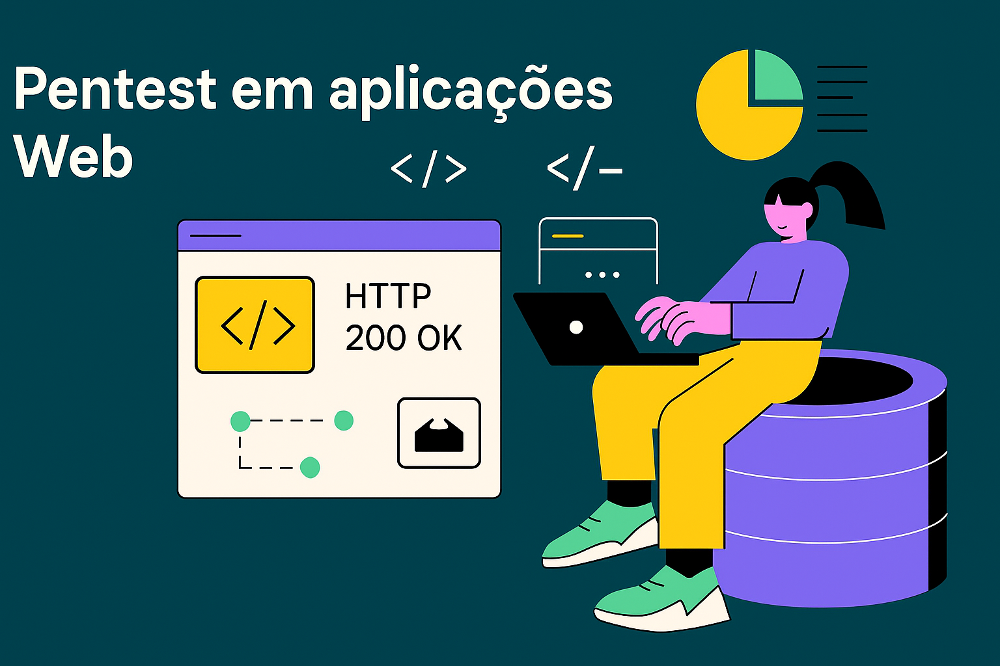

# Plano de estudos para Pentest em aplicações Web

A ideia desse plano é garantir que todos entendam o que é necessário aprender para ser um pentester em aplicações Web. 

1. Pentesters são profissionais de segurança ofensiva que tentam encontrar vulnerabilidades de segurança, avaliar o risco e explorar os cenários possíveis antes que um criminoso cibernético possa fazê-los.
2. Red Teamers se preocupam menos em encontrar todas as falhas de segurança. Seu objetivo é encontrar uma forma de entrar, explorá-la e depois se mover lateralmente pelo sistema até acessar os dados mais valiosos.  
3. Bug Bounty Hunter é o profissional independente, que se dedica a encontrar falhas de segurança, vulnerabilidades ou erros em sistemas, aplicações e infraestruturas digitais. Reportando essas falhas para as instituições por meio de plataformas oficiais e recebendo recompensas financeiras por isso.

Ou seja, ser pentester é completamente diferente de ser bug bounty hunter, Red Team etc. Embora que, para se destacar em qualquer uma dessas funções, você deve ser bom em pentesting.

Esse artigo te ajudará a entender esses conceitos de forma aprofundada - [Pentesters vs Red Team](https://www.mitnicksecurity.com/blog/red-team-operations-vs.-penetration-testing).  

Normalmente, leva cerca de **6 meses** para dominar os fundamentos e conseguir um emprego de nível inicial como pentest ou offsec em uma empresa.  

## Plano de estudo
1. [Conceitos de Pentest](#conceitos-de-pentest) – 6 semanas  
2. [Ferramentas de Trabalho](#ferramentas-de-trabalho) – 2 semanas  
3. [Práticas em Laboratório](#práticas-em-laboratório) – 8 semanas  
4. [Livros](#livros) - Leia 1–2 livros – 2–3 meses  
5. [Vídeos](#vídeos) - Assista pelo menos 1 vídeo por semana
6. [Cursos](#cursos) – Tente completar pelo menos um curso - 1–2 meses
7. [Certificações](#certificações) – conforme sua disponibilidade e interesse 

## Livros
1. [Penetration Testing: A Hands-On Introduction to Hacking](https://a.co/d/1qKxVMt) - Conceitos gerais de pentest e testes de segurança em aplicações Web  
2. [Web Application Security: Exploitation and Countermeasures for Modern Web Applications](https://a.co/d/8nPyvfH) - Aprenda os pilares de segurança de uma aplicação Web  
3. [The Hacker Playbook 3](https://a.co/d/09CIU8P)

### E-books de ouro
[Web Hacking 101 (Peter Yaworski)](https://digtvbg.com/files/books-for-hacking/Web%20Hacking%20101%20-%20How%20to%20Make%20Money%20Hacking%20Ethically%20by%20Peter%20Yaworski.pdf)  
[Pentest em aplicações web: Avalie a segurança contra ataques web com testes de invasão no Kali Linux](https://a.co/d/8u1YHo9)

---

## Vídeos
- [Pentest Web | Giovana Assis - Youtube](https://youtu.be/RUmbr_DgUrQ?si=odFfY9CJ5K0zoyKw)
- [Pentest para iniciantes – YouTube](https://www.youtube.com/watch?v=X4eRbHgRawI)  
- [Playlist de cursos de Web Security](https://www.youtube.com/playlist?list=PL1y1iaEtjSYiiSGVlL1cHsXN_kvJOOhu-)  

---

## Blogs / Referências
- [OWASP Web Security Testing Guide - WSTG](https://owasp.org/www-project-web-security-testing-guide/stable/)
- [Awesome Web Security - Syue Siang](https://github.com/qazbnm456/awesome-web-security)
- [Exploit DB](https://www.exploit-db.com/)  
- [CVE](https://cve.mitre.org/cve/)  
- [Schneier on Security](https://www.schneier.com/)  
- [Krebs on Security](https://krebsonsecurity.com/)

---

## Cursos
- [Cybrary](https://www.cybrary.it/catalog/refined/?q=owasp)
- [Ethical Hacking Web Application](https://gohacking.com.br/curso/ethical-hacking-web-application)
- [Pentester Academy](https://www.pentesteracademy.com/)  
- [Stanford – Introdução a Web Security](https://online.stanford.edu/courses/xcs100-introduction-web-security)  
- [Udemy – Pentesting para iniciantes](https://www.udemy.com/course/learn-website-hacking-penetration-testing-from-scratch/)  
- [EdX – Pentesting](https://www.edx.org/learn/penetration-testing)  
- [Web Security Academy (PortSwigger)](https://portswigger.net/web-security)  
- [MIT – Computer Systems Security](https://ocw.mit.edu/courses/6-858-computer-systems-security-fall-2014/video_galleries/video-lectures/)  
- [pwn.guide](https://pwn.guide/)  

---

## Certificações
- [CEH](https://www.eccouncil.org/programs/certified-ethical-hacker-ceh/)  
- [eJPT](https://elearnsecurity.com/product/ejpt-certification/)  
- [eWPTXv2](https://elearnsecurity.com/product/ewptxv2-certification/)  
- [OSCP](https://www.offensive-security.com/pwk-oscp/)  
- [OSWE](https://www.offensive-security.com/awae-oswe/)  
- [GPEN](https://www.giac.org/certifications/penetration-tester-gpen/)  
- [GWAPT](https://www.giac.org/certifications/web-application-penetration-tester-gwapt/)  

Lista completa de [certificações em segurança](https://github.com/jassics/cybersecurity-skills-career-roadmap/blob/master/cybersecurity-certifications.md).   

---

## Práticas em Laboratório
- [Kontra OWASP Top 10](https://application.security/free/owasp-top-10)  
- [HackTheBox](https://www.hackthebox.com/)  
- [TryHackMe](https://tryhackme.com/)  
- [OWASP WebGoat](https://owasp.org/www-project-webgoat/)  
- [OWASP JuiceShop](https://owasp.org/www-project-juice-shop/)  
- [PentesterLab](https://pentesterlab.com/)  
- [AttackDefense Lab](https://attackdefense.com/) (pago)  
- [DVWA](https://dvwa.co.uk/)

---

## Conceitos de Pentest
Compreenda bem os conceitos básicos de segurança como **HTTP Security Response Headers, Bruteforce, DoS, XSS, CSRF, SSRF, Prototype Pollution, Open Redirect, Injection, IDOR, JWT, oAuth** etc.  

### Conceitos Básicos
1. Entendimento de [métodos HTTP](https://developer.mozilla.org/en-US/docs/Web/HTTP/Methods), diferença entre PUT e POST, UPDATE vs PATCH, uso do método OPTIONS.  
2. Capacidade de [interpretar status code HTTP](https://developer.mozilla.org/en-US/docs/Web/HTTP/Status).  
   - O que significa receber 200 após enviar algo malicioso?  
   - O que fazer se receber 403?  
   - Tente gerar um 500 e entenda o que isso revela.  
3. Compreensão profunda dos [HTTP headers](https://developer.mozilla.org/en-US/docs/Web/HTTP/Headers), principalmente response headers.  
4. Compreenda o 3-way-handshake do TCP.  
5. Funcionamento do SSL.  
6. [Conceitos básicos e fundamentais de segurança](https://www.sneakymonkey.net/infosec-newbie/)
   
### Conceitos de Segurança
A maioria pode ser encontrada no [OWASP Cheatsheet](https://cheatsheetseries.owasp.org/index.html).  
Entenda os conceitos fundamentais, como se tornam vulneráveis e como explorá-los ou mitigá-los:  

- Autenticação (AuthN) e Autorização (AuthZ).  
- Vulnerabilidades em sessões e cookies.  
- XSS em profundidade.  
- Injeções (SQLi, RFI, LFI, NoSQL, GraphQL etc.).  
- SSRF, CSRF, Mass Assignment, XXE.  
- CSP, CORS.  
- Exploração de falhas de sessão (fixação, hijacking).  
- Tokens JWT.  
- Bruteforce automatizado e Credential Stuffing.  
- Exploração de vulnerabilidades de terceiros.  
- Testes Black Box vs White Box.  
- Diferenças entre SAST e DAST.  

### Nível Avançado
- OWASP Testing Guide hands-on.  
- Exploração de vulnerabilidades até alcançar RCE.  
- Injeção de comandos no SO.  
- BOLA e BFLA.  
- Solu;óes com cifra fracas.  
- Injeções avançadas (SQL, XML, JSON, SAML, LDAP, Template Injection, Deserialization).  

---

## Ferramentas de Trabalho
Ferramentas não são tudo, mas são importantes para eficiência. Entenda bem suas funcionalidades e quando utilizá-las.  

- Kali Linux
- Way Back Machine
- Burp Suite Pro
- JWT.io
- JS Obfuscator
- Metasploit  
- Nmap  
- Dirb  
- Nikto  
- Fierce  
- Dnsenum  
- Sqlmap  
- Shodan  
- BeeF  
- Arachni  
- Wireshark  
- Hydra  
- WafW00f

---

## Vazamento de dados - Leaking

- **[HTTPLeaks](https://github.com/cure53/HTTPLeaks)** - Todas as maneiras possíveis pelas quais um site pode vazar requisições HTTP.
- **[dvcs-ripper](https://github.com/kost/dvcs-ripper)** - Extrai sistemas de controle de versão distribuídos acessíveis pela web: SVN/GIT/HG.
- **[DVCS-Pillage](https://github.com/evilpacket/DVCS-Pillage)** - Encontre repositórios GIT, HG e BZR acessíveis pela web.
- **[GitMiner](https://github.com/UnkL4b/GitMiner)** - Ferramenta para mineração avançada de conteúdo no GitHub.
- **[gitleaks](https://github.com/zricethezav/gitleaks)** - Pesquisa todo o histórico do repositório em busca de segredos e chaves.
- **[CSS-Keylogging](https://github.com/maxchehab/CSS-Keylogging)** - Extensão do Chrome que explora keylogging via CSS.
- **[pwngitmanager](https://github.com/allyshka/pwngitmanager)** - Gerenciador de Git para pentesters.
- **[LinkFinder](https://github.com/GerbenJavado/LinkFinder)** - Script em Python que encontra endpoints em arquivos JavaScript, por *@GerbenJavado*.

## Detecção

- **[retire.js](https://github.com/RetireJS/retire.js)** - Scanner que detecta o uso de bibliotecas JavaScript com vulnerabilidades conhecidas.
- **[malware-jail](https://github.com/HynekPetrak/malware-jail)** - Sandbox para análise semiautomática de malware em JavaScript, desofuscação e extração de payloads.
- **[repo-supervisor](https://github.com/auth0/repo-supervisor)** - Escaneia seu código em busca de má configuração de segurança, senhas e segredos.

---

## Networking
Ter um bom networking é fundamental para quem quer trabalhar com segurança ofensiva no Brasil. Você pode não acreditar, mas todo mundo se conhece.

- Conecte-se com profissionais de segurança no LinkedIn.  
- Encontre um mentor. Eu posso te ajudar aqui ;)  
- Participe de meetups e conferências (online/offline).  
- Escreva artigos técnicos, mesmo sobre conceitos básicos.  
- Participe de webinars e eventos.  
- Ajude iniciantes.  

---

## Quem seguir
- [Dave Kennedy](https://twitter.com/HackingDave)  
- [Kevin Mitnick](https://twitter.com/kevinmitnick)  
- [The Hacker News](https://twitter.com/TheHackersNews)  
- [PortSwigger](https://twitter.com/PortSwigger)  
- [Defcon](https://twitter.com/defcon)  
- [Nullcon](https://twitter.com/nullcon)  
- [NahamSec](https://twitter.com/NahamSec)  
- [TryHackMe](https://twitter.com/RealTryHackMe)  
- [HackerOne](https://twitter.com/Hacker0x01)  
- [BugCrowd](https://twitter.com/Bugcrowd)  
- [OWASP](https://twitter.com/owasp)  
- [Troy Hunt](https://twitter.com/troyhunt)  
- [Binni Shah](https://twitter.com/binitamshah)  
- [TomNomNom](https://twitter.com/TomNomNom)  
- [Hacking Articles](https://twitter.com/hackinarticles)  
